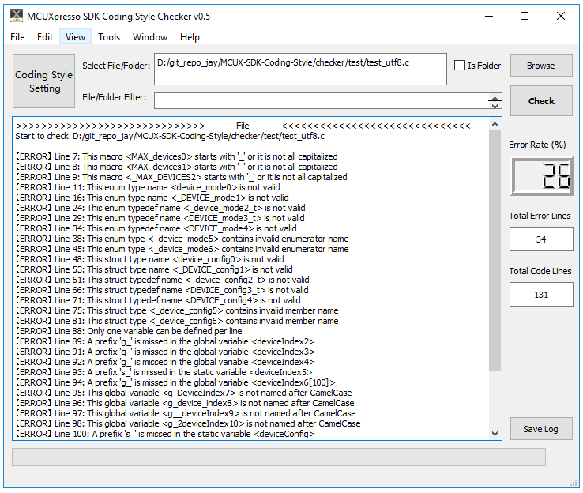

# MCUXpresso SDK Coding Style

### 1.代码风格

> * 风格细则：https://github.com/JayHeng/MCU-CodingStyleChecker/blob/master/coding_style.md

### 2.代码模板

> * 头文件模板：https://github.com/JayHeng/MCU-CodingStyleChecker/blob/master/template.h
> * 源文件模板：https://github.com/JayHeng/MCU-CodingStyleChecker/blob/master/template.c

### 3.检查工具

　　MCUXpresso SDK Coding Style Checker 是恩智浦 SDK 驱动 C 代码风格配套检查工具，其功能类似于 [Linux](https://github.com/torvalds/linux) 下的 scripts/checkpatch.pl 脚本和谷歌开源项目 [styleguide](https://github.com/google/styleguide) 下的 cpplint/cpplint.py 脚本，只不过提供的规范检查没有这两个工具丰富，是一个轻量级的工具。此外本工具基于 PyQt5 做了一个简洁的 GUI，更适合普通 MCU 开发者使用。  

> * 工具：\MCU-CodingStyleChecker\checker\bin\MCUX-SDK-CodingStyleChecker.exe

　　MCUXpresso SDK Coding Style Checker 主要功能如下：  

> * 支持选择单文件或整个文件夹去检查  
> * 自动识别 .c/.h 后缀文件，但要保证文件是 UTF-8 或 ASCII 编码（即不能包含非英文字符）  
> * 能够显示检查结果的统计信息（总代码行，错误行，错误率）  
> * 支持检查结果Log的保存  
> * 支持检查五种通用注释头（Definitions/Variables/Prototypes/Code/API）  
> * 支持检查全局变量的命名规范（在Variables注释头下） - coding_style.md | rule 1.1  
> * 支持检查宏定义的命名规范（在Definitions注释头下） - coding_style.md | rule 1.2  
> * 支持检查枚举定义的命名规范（在Definitions注释头下） - coding_style.md | rule 1.3  
> * 支持检查结构体定义的命名规范（在Definitions注释头下） - coding_style.md | rule 1.4  
> * 支持检查函数的命名规范（在Code注释头下） - coding_style.md | rule 1.5  
> * 支持检查头文件保护宏 - coding_style.md | rule 2.7  

　　To-Do List：  

> * 集成clang-format，检测开始前自动先做一次格式化  
> * 支持 coding_style.md里的 rule 2.x  
> * 支持检查规则设置（使能/不使能，命名风格自选择）  
> * 支持过滤文件/文件夹规则设置  
> * 支持检查的实时进度条显示  

